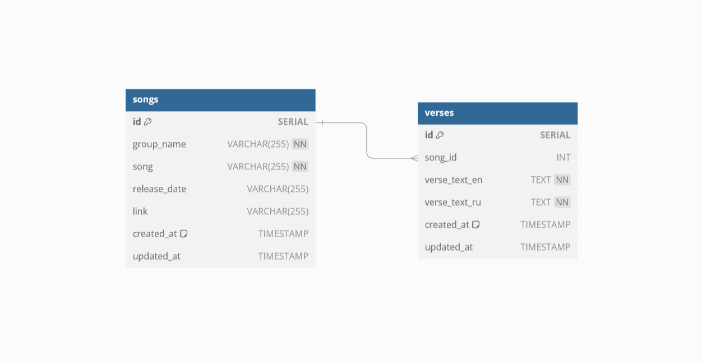

## Реализация онлайн библиотеки песен 🎶
1. Выставить rest методы
- Получение данных библиотеки с фильтрацией по всем полям и
пагинацией
- Получение текста песни с пагинацией по куплетам
- Удаление песни
- Изменение данных песни
- Добавление новой песни, при добавление сделать запрос во внешний API 
3. Обогащенную информацию положить в БД postgres (структура БД должна быть создана путем миграций при старте сервиса)
4. Покрыть код debug- и info-логами
5. Вынести конфигурационные данные в .env-файл
6. Сгенерировать сваггер на реализованное АПИ
# Реализация
Реализованы все основные функции:

1. Запуск веб-сервиса
2. Создание БД путем миграций при старте сервиса
3. Добавление песни (POST, http://localhost:port/song)
4. Получение списка всех задач (GET, http://localhost:port/songs?filter=&limit=&offset=)
4. Получение одной задачи (GET, http://localhost:port/song/id)
5. Редактирование задач (PATCH, http://localhost:port/song/id)
6. Удаление задач (DELETE, http://localhost:port/song/id)
7. Получение текста песни (GET, http://localhost:port/song/id/verse?lang=&limit=&offset=)
8. Удаление теста песни (DELETE, http://localhost:port/song/id/verse)
9. Редактирование текста песни (PATCH, http://localhost:port/song/id/verse)
10. Swagger UI (GET, http://localhost:port/swagger/index.html#)

# Схема БД


# Запуск проекта
1. Склонируйте репозиторий на локальную машину или скачайте архив с проектом
2. Откройте проект в редакторе кода, в терминале выполните команду:
```
go mod tidy
```
3. В файле .env находятся переменные окружения для запуска проекта, задайте им значения для вашей локальной машины, если не указывать, будут использованы параметры по умолчанию:

```
# Port on wich the application will run
# Default values "8081" if not provided
LIBRARY_PORT=""

# Port on wich the external server will run
# Default values "8080" if not provided

EXTERNAL_PORT=""

# Database user for connecting to the PostgreSQL database.
# Default value is "postgres" if not provided.
LIBRARY_USER=""

# Password for the database user.
# Default value is "root" if not provided.
LIBRARY_PASSWORD=""

# Host where the PostgreSQL database is located.
# Default value is "127.0.0.1" (localhost) if not provided.
LIBRARY_HOST=""

# Port on which the PostgreSQL database is listening.
# Default value is "5432" if not provided.
LIBRARY_DBPORT=""

# SSL mode for the PostgreSQL connection.
# Default value is "disable" if not provided.
LIBRARY_SSLMODE=""

#Name for database connection
#Default value is "music_library" if not provided.
LIBRARY_NAME=""
```
4. В терминале, находясь в основной директории проекта выполните команду:
```
go run cmd/main.go
```
5. БД будет создана автоматически.
# Проверка работоспособности 
## Проверка через swagger UI
1. Перейдите на http://localhost:8081/swagger/index.html# (измените номер порта на ваше значение LIBRARY_PORT="")
## Проверка через терминал
1. Добавления песни:
```
curl -i -X POST -H "Content-Type: application/json" -d '{"group_name":"Muse", "song": "Supermassive Black Hole"}' http://localhost:8081/song
```
 2. Получение всех песен:
 ```
curl -i -X GET -H "Content-Type: application/json" "http://localhost:8081/songs?filter=mu&limit=5&offset=0"
 ```
 3. Получение песни по ID:
 ```
curl -i -X GET -H "Content-Type: application/json" http://localhost:8081/song/1
 ```
 4. Редактирование песни:
 ```
curl -i -X PATCH -H "Content-Type: application/json" -d '{"group_name": "UpdateName", "song": "UpdateSong", "link": "UpdateLink"}' http://localhost:8081/song/1
```
5. Удаление песни по ID: 
```
curl -i -X DELETE -H "Content-type: application/json" http://localhost:8081/song/1
```
6. Получение текста песни по ID: 
```
curl -i -X GET -H "Content-type: application/json" "http://localhost:8081/song/1/verse?lang=ru&limit=20&offset=5"
```
7. Удаление текста песни по ID
```
curl -i -X DELETE -H "Content-type: application/json" http://localhost:8081/song/1/verse
```
8. 
```
curl -i -X PATCH -H "Content-Type: application/json" -d '{"verse_text_en": "UpdateTextru","verse_text_ru":"Новый текст"}' http://localhost:8081/
song/1/verse
```